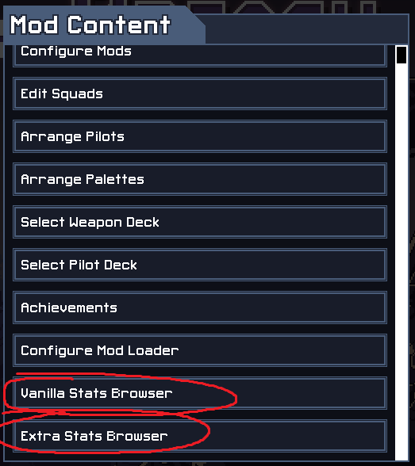

# ITB Extra Stats

Record extra stats for your runs and view all previous runs with the *Extra Stats Browser.*

Also adds an additional *Vanilla Stats Browser.*

## Features

*Extra Stats* adds two new buttons to the Mod Content menu:

### Extra Stats & Extra Stats Browser

Have you ever wanted to know how many tiles you cracked when playing Cataclysm, how many enemy attacks you cancelled when playing Rusting Hulks, or how much damage you did with your bomblings when playing Bombermechs? Now you can see all of those stats and more!

*Extra Stats* records the following stats for each of your runs, separated into two categories:

#### GENERAL STATS
- Kills
- Damage Dealt *(damage dealt to enemies)*
- Damage Taken *(damage taken from enemies)*
- Self Damage  *(damage dealt by friendly units to friendly units)*
- Healing
- Grid Damage
- Grid Resists
- Vek Pushed
- Vek Blocked  *(vek spawn blocked)*
- Vek Drowned  *(vek killed via drowning)*

#### SQUAD-SPECIFIC STATS
- **Rift Walkers**
- - Punch Distance *(distance traveled with punch weapon)*
- **Rusting Hulks**
- - Tiles Smoked *(smoke placed on tiles)*
- - Attacks Cancelled *(enemy attacks cancelled with smoke)*
- **Zenith Guard**
- - Shields *(shields placed on friendly units/buildings)*
- - Beam Damage *(damage done with laserbeam weapon, friend or foe)*
- **Blitzkrieg**
- - Lightning Damage *(damage done with chain-lightning weapon, friend or foe)*
- - Lightning Self Damage *(damage done to friendly units with chain-lightning weapon)*
- - Rocks Launched *(rocks launched with rock artillery weapon)*
- **Steel Judoka**
- - Vek Self Damage *(damage done by vek to other vek)*
- - Vek Self Kills *(vek killing other vek)*
- **Flame Behemoths**
- - Tiles Fired *(tiles set on fire)*
- - Units Fired *(units set on fire, friend or foe)*
- **Frozen Titans**
- - Units Frozen *(units frozen, friend or foe)*
- - Damage Blocked With Ice *(damage done to frozen units or buildings)*
- **Hazardous Mechs**
- - Leap Distance *(distance traveled with leaping mech weapon)*
- - Acid Applied *(enemy units afflicted with acid)*
- **Secret Squad**
- - Ram Distance *(distance traveled with beetle mech weapon)*
- **Bombermechs**
- - Bomblings Created
- - Bombling Damage *(damage done with bomblings, friend or foe)*
- **Arachnophiles**
- - Spiderlings Created
- - Spiderling Damage *(damage done with spiderlings, friend or foe)*
- **Mist Eaters**
- - Tiles Smoked *(smoke placed on tiles)*
- - Attacks Cancelled *(enemy attacks cancelled with smoke)*
- **Heat Sinkers**
- - **(WIP)** Boosts *(friendly units boosted)*
- - Units Fired *(units set on fire, friend or foe)*
- - Tiles Fired *(tiles set on fire)*
- **Cataclysm**
- - Tiles Cracked *(tiles cracked with drill mech)*
- - Tiles Destroyed *(cracked tiles turned into holes)*
- - Vek Pitted *(vek killed via falling into hole)*

Whenever you lose or win a run, *Extra Stats* will save your stats to be viewed back at a later time via the *Extra Stats Browser*. Stats will **NOT** be recorded when you abandon a run.

Scroll through the list and click on a game to view your stats!

### Vanilla Stats Browser

Ever been disappointed that ITB will only show you the top 5 scores for each of your squads? Now you can view ALL of your previous runs.

Scroll through all of your past runs, sorted by score. Click on a game in the list to see your loadout and stats. Mouse over pilots and weapons to see their names and descriptions.

## Installation

You must have the [ITB Modloader](https://github.com/itb-community/ITB-ModLoader) installed.

Simply download the latest release from the releases page to the right and extract the zip into your mods folder.

If installed correctly, you will see Extra Stats in the Mod Content -> Mod Configuration menu.

## Contributing
Contributions are welcome!

**TODO**
